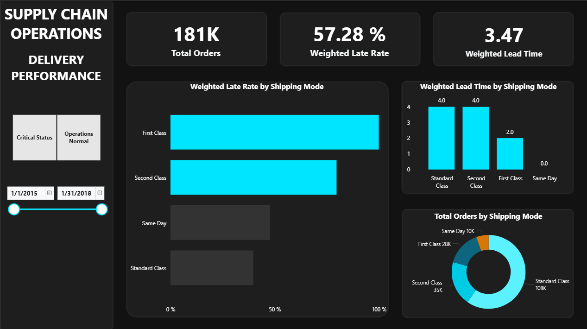

# Supply Chain Operations: Delivery Efficiency & Performance Pipeline

## Business Context
Optimizing supply chain logistics requires precise tracking of delivery performance across all shipping modes. The objective of this project was to analyze the DataCo Smart Supply Chain dataset (3 million+ records) to pinpoint delivery inefficiencies. I scoped the pipeline strictly to transactional delivery data to provide operations managers with a clear view of shipping bottlenecks and fulfillment rates.

## System Architecture & Engineering

### 1. Cloud Data Ingestion (Python & Neon PostgreSQL)
To simulate a modern enterprise environment, I bypassed local storage and engineered a cloud-based pipeline. 
* Database Connection: I utilized Python and SQLAlchemy to securely ingest the raw dataset into a Neon PostgreSQL cloud database.
* Flattening the Data: I executed SQL CREATE VIEW scripts directly in the cloud to flatten the relational data, isolating the exact delivery metrics required for the reporting layer.

### 2. Data Transformation (Power Query)
I connected Power BI directly to the Neon cloud database to build the data model.
* Conditional Feature Engineering: To establish strict operational benchmarks, I used Power Query to engineer a new categorical column (Status Label). This logic evaluated the delivery_rate_pct to automatically classify shipments as meeting or failing efficiency targets.

### 3. Executive Interface & Reporting
The final deliverable was structured to serve both analytical and executive stakeholders.
* Custom Dashboard Layout: I designed a structural background in PowerPoint and imported it into Power BI. This eliminated the visual clutter of standard templates and kept the focus entirely on the metrics.
* Actionable KPIs: I built centralized DAX measures to calculate core performance indicators, mapping them exclusively to clean, straightforward visuals without unnecessary borders or heavy graphics.
* Stakeholder Presentation: I translated the dashboard findings into a targeted executive slide deck, highlighting specific delivery inefficiencies and providing data-driven operational recommendations.

## Key Insights & Operational Value
This dashboard provides operations managers with a direct view into fulfillment efficiency. By focusing exclusively on shipping modes, I identified the following:

* Standard Shipping is the Most Reliable: Standard shipping had the lowest overall rate of late deliveries, making it the most dependable option for everyday fulfillment.
* Tracking Premium Delays: While Same Day shipping successfully delivered the fastest overall turnaround times, the dashboard highlights exactly when these high-priority, premium shipments miss their tight deadlines.
* Focused Performance Tracking: By focusing strictly on shipping modes rather than locations or product types, this dashboard gives the operations team a clear, unobstructed view of how well the logistics network is actually performing.
